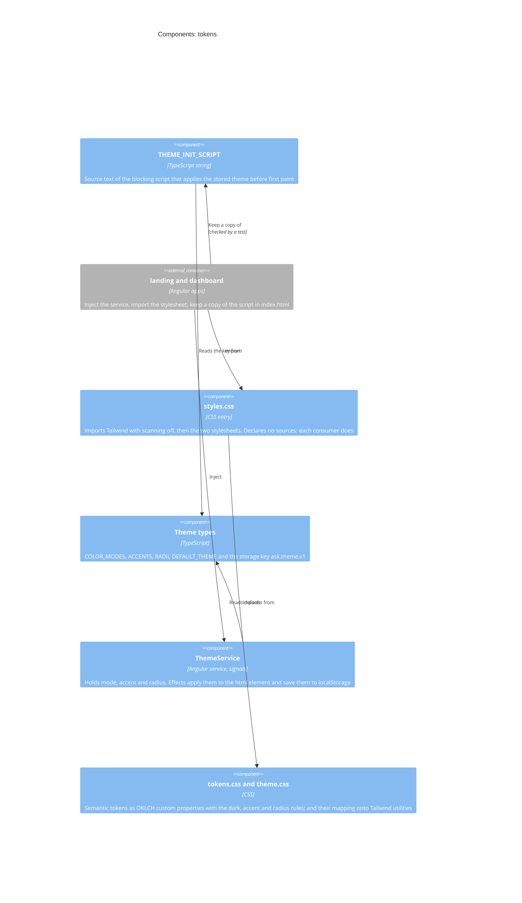
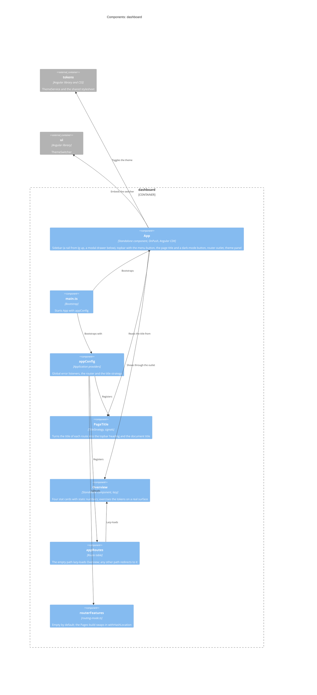
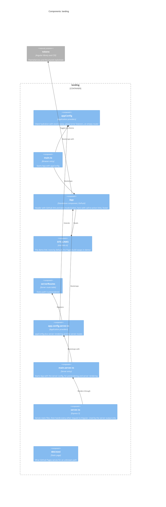
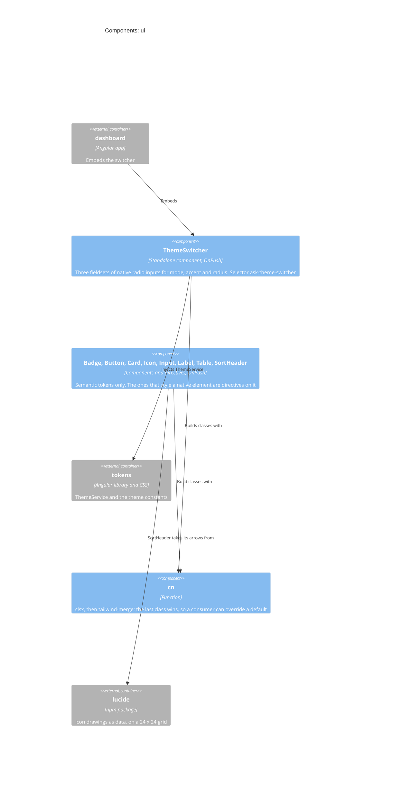
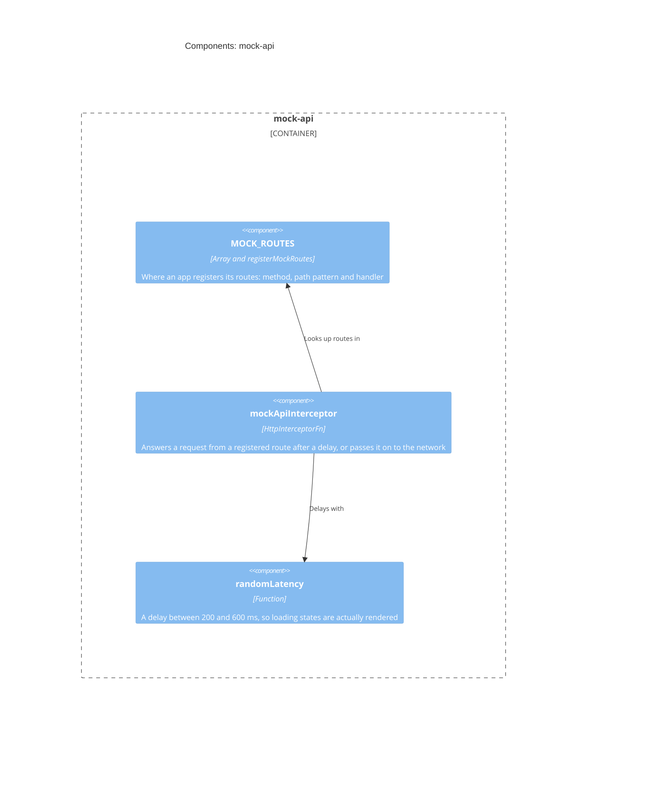

# Level 3: Components

What is inside each container. Every arrow is an import, a registration or a
reference that exists in the source today. Helper functions and private types are
left out: this is the map, not the index.

- [tokens](#tokens) - the theme, and the heart of the kit
- [dashboard](#dashboard)
- [landing](#landing)
- [ui](#ui)
- [mock-api](#mock-api)

## tokens

Owns the design tokens and the runtime that switches them. Everything else in the kit
reads from here ([ADR 0004](../adr/0004-semantic-design-tokens-and-three-axis-theming.md)).
The blue boxes are the components; the grey one is the code that uses them.

| Component           | Source                                                                                                                                                                   | Notes                                                                                                                                                                                                                                                                            |
| ------------------- | ------------------------------------------------------------------------------------------------------------------------------------------------------------------------ | -------------------------------------------------------------------------------------------------------------------------------------------------------------------------------------------------------------------------------------------------------------------------------- |
| `ThemeService`      | [`theme.service.ts`](../../libs/tokens/src/lib/theme.service.ts)                                                                                                         | `providedIn: 'root'`. Constructed on the server too, so every DOM and storage access is behind a platform check. The server renders the default theme; the browser corrects it on hydration.                                                                                     |
| Theme types         | [`theme.types.ts`](../../libs/tokens/src/lib/theme.types.ts)                                                                                                             | The axes are `const` tuples, so a picker iterates the same list the types come from.                                                                                                                                                                                             |
| `THEME_INIT_SCRIPT` | [`theme-init.ts`](../../libs/tokens/src/lib/theme-init.ts)                                                                                                               | An inline script cannot import, so each app's `index.html` holds a hand-kept copy. `theme-init.spec.ts` fails when a copy drifts. Change all three together.                                                                                                                     |
| Stylesheets         | [`styles.css`](../../libs/tokens/src/styles.css), [`tokens.css`](../../libs/tokens/src/lib/styles/tokens.css), [`theme.css`](../../libs/tokens/src/lib/styles/theme.css) | Order matters: Tailwind, then the raw variables, then the mapping. `source(none)` switches off Tailwind's automatic scan, so each app ships only its own utilities: it declares its own `@source`s, and the entry declares none, so it works installed under `node_modules` too. |

## dashboard

A client-side single-page app ([ADR 0007](../adr/0007-prerendered-landing-and-client-side-dashboard.md)).
No server, no hydration, no data layer yet.

| Component        | Source                                                                                                                                           | Notes                                                                                                                                                                                                                                                                                                                                                                                                               |
| ---------------- | ------------------------------------------------------------------------------------------------------------------------------------------------ | ------------------------------------------------------------------------------------------------------------------------------------------------------------------------------------------------------------------------------------------------------------------------------------------------------------------------------------------------------------------------------------------------------------------- |
| `App`            | [`app.ts`](../../apps/dashboard/src/app/app.ts), [`app.html`](../../apps/dashboard/src/app/app.html)                                             | From the `lg` breakpoint up (`BreakpointObserver`) the sidebar is a rail beside the content; below it, a drawer over it. The open drawer traps focus (`CdkTrapFocus`), makes the content column inert and closes on Escape, its Close button, the backdrop or a followed link, handing focus back to the menu button. Widths are the layout tokens. The five planned pages are text with a "soon" badge, not links. |
| `PageTitle`      | [`page-title.ts`](../../apps/dashboard/src/app/page-title.ts)                                                                                    | A `TitleStrategy`: the router calls it after every navigation. It keeps the title in a signal for the topbar `h1`, so a page starts its own headings at `h2`, and sets the document title.                                                                                                                                                                                                                          |
| `appRoutes`      | [`app.routes.ts`](../../apps/dashboard/src/app/app.routes.ts)                                                                                    | Every route has a `title`. The `**` redirect sends an unknown path to Overview.                                                                                                                                                                                                                                                                                                                                     |
| `Overview`       | [`overview.ts`](../../apps/dashboard/src/app/pages/overview.ts)                                                                                  | Placeholder. Nothing here fetches data, so the [mock API](#mock-api) is not involved.                                                                                                                                                                                                                                                                                                                               |
| `routerFeatures` | [`routing-mode.ts`](../../apps/dashboard/src/app/routing-mode.ts), [`routing-mode.pages.ts`](../../apps/dashboard/src/app/routing-mode.pages.ts) | Swapped at build time by `fileReplacements` in the `pages` configuration, so the Pages demo gets hash URLs and every other build keeps path URLs ([ADR 0011](../adr/0011-github-pages-demo-site.md)).                                                                                                                                                                                                               |

## landing

The marketing page. It is built two ways from one source: static files for GitHub
Pages, or a server output that runs behind Node ([deployment](c4-deployment.md)).

| Component    | Source                                                                                                                                                                                                        | Notes                                                                                                                                                                                                               |
| ------------ | ------------------------------------------------------------------------------------------------------------------------------------------------------------------------------------------------------------- | ------------------------------------------------------------------------------------------------------------------------------------------------------------------------------------------------------------------- |
| `App`        | [`app.ts`](../../apps/landing/src/app/app.ts), [`app.html`](../../apps/landing/src/app/app.html)                                                                                                              | The router has no routes: the page is the shell. The "Live demo" button renders only when `SITE_LINKS.demo` is set.                                                                                                 |
| `SITE_LINKS` | [`site-links.ts`](../../apps/landing/src/app/site-links.ts), [`site-links.pages.ts`](../../apps/landing/src/app/site-links.pages.ts), [`site-links.types.ts`](../../apps/landing/src/app/site-links.types.ts) | Swapped at build time like the dashboard's `routerFeatures`; the shared type lives in its own file so neither variant imports the other.                                                                            |
| `server.ts`  | [`server.ts`](../../apps/landing/src/server.ts)                                                                                                                                                               | Express 5 rejects a bare `/**` route, so the catch-all is `app.use` with no path. Refuses every request until `NG_ALLOWED_HOSTS` is set ([ADR 0007](../adr/0007-prerendered-landing-and-client-side-dashboard.md)). |
| `404.html`   | [`404.html`](../../apps/landing/public/404.html)                                                                                                                                                              | Self-contained, with absolute links under `/angular-saas-kit/`.                                                                                                                                                     |

## ui

The components, the switcher and `cn`, and the reason `ui` depends on `tokens`.

`ThemeSwitcher` ([source](../../libs/ui/src/lib/theme-switcher/theme-switcher.ts)) knows no
colour value: it only calls `ThemeService`, which flips attributes on the html element.
That makes it the kit's proof that the token layer works. `cn`
([source](../../libs/ui/src/lib/utils/cn.ts)) is the helper every component funnels its
host classes through ([ADR 0005](../adr/0005-angular-cdk-and-tailwind-instead-of-a-ui-library.md)).

The other components are listed in the [components guide](../guide/components.md#what-exists),
each with a README next to its source. `Button`, `Input`, `Label`, `Table` and the card parts are
directives on the native element they style; `Icon` draws a Lucide icon's data as inline SVG
([ADR 0017](../adr/0017-icons-from-lucide-data-drawn-by-one-component.md)). Nothing in the
workspace uses them yet apart from their tests; the dashboard's pages will.

The package also ships a one-line stylesheet, `libs/ui/assets/styles.css`, that points
Tailwind at the compiled components (`@source './fesm2022'`) so an app that installs the
package gets the utilities they use. Nothing in the workspace imports it: the dashboard
points Tailwind at `libs/ui/src` directly. See
[ADR 0016](../adr/0016-packages-declare-and-ship-what-they-need.md).

## mock-api

Built and tested, and used by nothing yet ([ADR 0006](../adr/0006-in-memory-mock-api-instead-of-a-backend.md)).

A route path may carry `:name` segments, which arrive in the handler as `params`.
A request that matches no route goes to `next(req)`, so the interceptor is safe to add
to an app that already talks to a real API
([source](../../libs/mock-api/src/lib/mock-api.interceptor.ts)).

Next: [deployment](c4-deployment.md).
