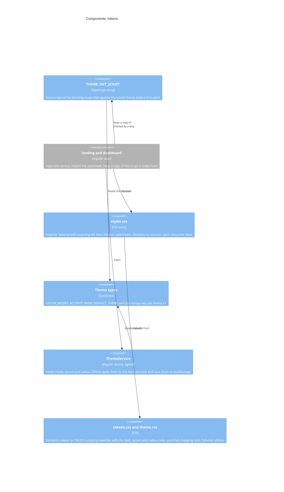
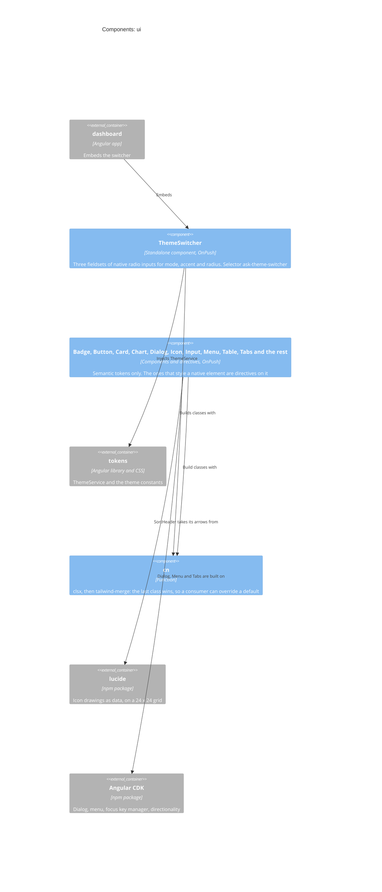
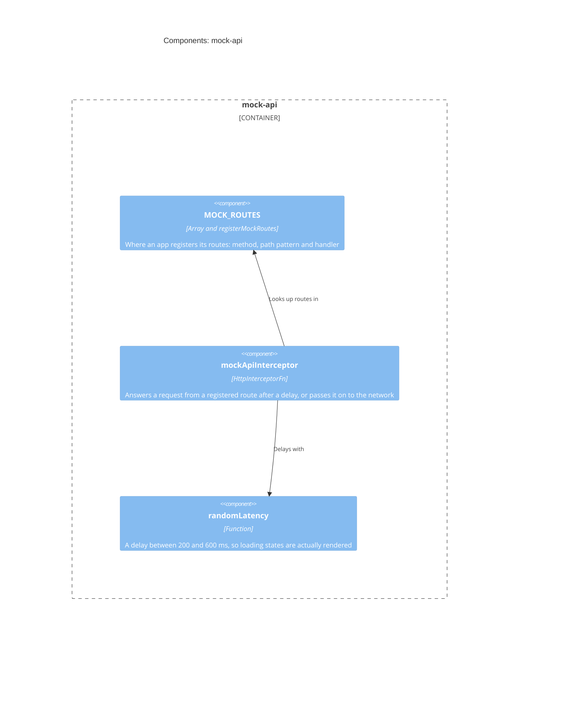

# Level 3: Components

What is inside each container. Every arrow is an import, a registration or a
reference that exists in the source today. Helper functions and private types are
left out: this is the map, not the index.

- [tokens](#tokens) - the theme, and the heart of the kit
- [dashboard](#dashboard)
- [landing](#landing)
- [ui](#ui)
- [mock-api](#mock-api)

## tokens

Owns the design tokens and the runtime that switches them. Everything else in the kit
reads from here ([ADR 0004](../adr/0004-semantic-design-tokens-and-three-axis-theming.md)).
The blue boxes are the components; the grey one is the code that uses them.

| Component           | Source                                                                                                                                                                   | Notes                                                                                                                                                                                                                                                                            |
| ------------------- | ------------------------------------------------------------------------------------------------------------------------------------------------------------------------ | -------------------------------------------------------------------------------------------------------------------------------------------------------------------------------------------------------------------------------------------------------------------------------- |
| `ThemeService`      | [`theme.service.ts`](../../libs/tokens/src/lib/theme.service.ts)                                                                                                         | `providedIn: 'root'`. Constructed on the server too, so every DOM and storage access is behind a platform check. The server renders the default theme; the browser corrects it on hydration.                                                                                     |
| Theme types         | [`theme.types.ts`](../../libs/tokens/src/lib/theme.types.ts)                                                                                                             | The axes are `const` tuples, so a picker iterates the same list the types come from.                                                                                                                                                                                             |
| `THEME_INIT_SCRIPT` | [`theme-init.ts`](../../libs/tokens/src/lib/theme-init.ts)                                                                                                               | An inline script cannot import, so each app's `index.html` holds a hand-kept copy. `theme-init.spec.ts` fails when a copy drifts. Change all three together.                                                                                                                     |
| Stylesheets         | [`styles.css`](../../libs/tokens/src/styles.css), [`tokens.css`](../../libs/tokens/src/lib/styles/tokens.css), [`theme.css`](../../libs/tokens/src/lib/styles/theme.css) | Order matters: Tailwind, then the raw variables, then the mapping. `source(none)` switches off Tailwind's automatic scan, so each app ships only its own utilities: it declares its own `@source`s, and the entry declares none, so it works installed under `node_modules` too. |

## dashboard

A client-side single-page app ([ADR 0007](../adr/0007-prerendered-landing-and-client-side-dashboard.md)).
No server and no hydration. The root is a router outlet; the routes pick the layout, the shell
or the sign-in pages' card. The shell loads first; the pages, and the `HttpClient` they fetch
with, load lazily. In development and in the demo the [mock API](#mock-api) answers `/api`;
the production build has no mock.

```mermaid
%%{init: {"c4": {"c4ShapeMargin": 100}}}%%
C4Component
  title Components: dashboard

  Container_Ext(tokens, "tokens", "Angular library and CSS", "ThemeService and the shared stylesheet")
  Container_Ext(ui, "ui", "Angular library", "Card, Table, Badge, Button, ThemeSwitcher")
  Container_Ext(mockapi, "mock-api", "Angular library", "The interceptor and its route registry")

  Container_Boundary(dashboard, "dashboard") {
    Component(app, "App", "Standalone component", "The root: a router outlet")
    Component(shell, "Shell", "Standalone component, OnPush, Angular CDK", "Sidebar (a rail from lg up, a modal drawer below) with a sign-out link, topbar with the menu button, the page title, a Demo data label and a dark-mode button")
    Component(auth, "AuthLayout and the sign-in pages", "Standalone components, lazy", "Sign in, create an account, reset a password: signal forms on a centred card")
    Component(main, "main.ts", "Bootstrap", "Starts App with appConfig")
    Component(config, "appConfig", "Application providers", "Global error listeners, the router and the title strategy")
    Component(title, "PageTitle", "TitleStrategy, signals", "Turns the title of each route into the topbar heading and the document title")
    Component(routes, "appRoutes", "Route table", "The three sign-in pages, and the shell with the page routes")
    Component(pages, "pageRoutes", "Route table, lazy", "Provides HttpClient with the backend's interceptors; the five pages, and a redirect for anything else")
    Component(overview, "Overview and Analytics", "Standalone components, lazy", "Figures, charts and the latest orders, from /api/stats, /api/analytics and /api/orders with httpResource")
    Component(lists, "Orders, Customers, Products", "Standalone components, lazy", "Searchable, sortable, paged lists through listQuery; an order row has a menu with its details and a confirmed refund")
    Component(settings, "Settings", "Standalone component, lazy", "Tabs: a profile signal form, notification checkboxes, and the theme switcher")
    Component(backend, "mock-backend.ts", "fileReplacements", "Registers the demo routes over a seeded dataset. The production build swaps in an empty file")
    Component(demo, "DEMO_DATA", "demo-data.ts", "True where the mock answers; the production build swaps in false")
    Component(mode, "routerFeatures", "routing-mode.ts", "Empty by default; the Pages build swaps in withHashLocation")
  }

  Rel(main, app, "Bootstraps")
  Rel(main, config, "Bootstraps with")
  Rel(shell, tokens, "Toggles the theme")
  Rel(shell, title, "Reads the title from")
  Rel(shell, demo, "Reads")
  Rel(config, routes, "Registers")
  Rel(config, title, "Registers")
  Rel(config, mode, "Spreads")
  Rel(routes, auth, "Lazy-loads")
  Rel(routes, shell, "Shows")
  Rel(routes, pages, "Lazy-loads")
  Rel(pages, backend, "Provides HttpClient with")
  Rel(pages, overview, "Lazy-loads")
  Rel(pages, lists, "Lazy-loads")
  Rel(pages, settings, "Lazy-loads")
  Rel(overview, ui, "Builds on")
  Rel(lists, ui, "Build on")
  Rel(settings, ui, "Embeds the switcher")
  Rel(backend, mockapi, "Registers routes with")

  UpdateLayoutConfig($c4ShapeInRow="3", $c4BoundaryInRow="1")
```

| Component                   | Source                                                                                                                                                                                               | Notes                                                                                                                                                                                                                                                                                                                                                                                                                                                                                                                                                     |
| --------------------------- | ---------------------------------------------------------------------------------------------------------------------------------------------------------------------------------------------------- | --------------------------------------------------------------------------------------------------------------------------------------------------------------------------------------------------------------------------------------------------------------------------------------------------------------------------------------------------------------------------------------------------------------------------------------------------------------------------------------------------------------------------------------------------------- |
| `Shell`                     | [`shell.ts`](../../apps/dashboard/src/app/layout/shell.ts), [`shell.html`](../../apps/dashboard/src/app/layout/shell.html)                                                                           | From the `lg` breakpoint up (`BreakpointObserver`) the sidebar is a rail beside the content; below it, a drawer over it. The open drawer traps focus (`CdkTrapFocus`), makes the content column inert and closes on Escape, its Close button, the backdrop or a followed link, handing focus back to the menu button. Widths are the layout tokens. A planned page can be listed with a "soon" badge, as text, not a link; none is today. The Demo data label is a plain span: `ask-badge` would bring `cn()` and tailwind-merge into the initial bundle. |
| AuthLayout, sign-in pages   | [`auth/`](../../apps/dashboard/src/app/auth/sign-in.ts)                                                                                                                                              | Each page has its own path, wrapped in `AuthLayout`: an empty-path parent for all three would also match `/` and hide the shell. The forms are signal forms with the dashboard's error pattern (`forms/field-errors.ts`). There is no authentication: a valid form goes to the dashboard, and the demo says so.                                                                                                                                                                                                                                           |
| `PageTitle`                 | [`page-title.ts`](../../apps/dashboard/src/app/page-title.ts)                                                                                                                                        | A `TitleStrategy`: the router calls it after every navigation. It keeps the title in a signal for the topbar `h1`, so a page starts its own headings at `h2`, and sets the document title.                                                                                                                                                                                                                                                                                                                                                                |
| `pageRoutes`                | [`pages.routes.ts`](../../apps/dashboard/src/app/pages/pages.routes.ts)                                                                                                                              | `provideHttpClient` lives here, not in `appConfig`, so the pages' HTTP code and the mock stay out of the initial bundle. Every route has a `title`.                                                                                                                                                                                                                                                                                                                                                                                                       |
| Overview, Analytics         | [`overview.ts`](../../apps/dashboard/src/app/pages/overview.ts), [`analytics.ts`](../../apps/dashboard/src/app/pages/analytics.ts)                                                                   | Each section has its own loading (placeholders, `aria-busy`), error (a retry) and empty states. The charts are `ask-chart`, which carries its data as a table ([ADR 0018](../adr/0018-charts-as-svg-on-the-chart-tokens-with-a-data-table.md)); Analytics keeps the last report on screen while another period loads.                                                                                                                                                                                                                                     |
| Orders, Customers, Products | [`orders/`](../../apps/dashboard/src/app/pages/orders/orders.ts), [`customers.ts`](../../apps/dashboard/src/app/pages/customers.ts), [`products.ts`](../../apps/dashboard/src/app/pages/products.ts) | Each list is a `listQuery` ([`list-query.ts`](../../apps/dashboard/src/app/data/list-query.ts)): search (debounced), filters, sort and page as signals, one `httpResource` that follows them, and the last page kept on screen while the next loads. A new search, filter or sort goes back to page 1. An order row's menu opens its details, or a refund behind an `alertdialog`; focus returns to the row's button.                                                                                                                                     |
| `Settings`                  | [`settings/`](../../apps/dashboard/src/app/pages/settings/settings.ts)                                                                                                                               | Three tabs (`ask-tabs`). Profile is a signal form (`@angular/forms/signals`): `submit()` saves only a valid form, errors are text tied to their field with `aria-describedby`, and the first field in error gets the focus. Notifications are native checkboxes in a fieldset. Appearance is the theme switcher, moved here from the shell.                                                                                                                                                                                                               |
| `mock-backend.ts`           | [`mock-backend.ts`](../../apps/dashboard/src/app/mock-backend.ts), [`mock/`](../../apps/dashboard/src/app/mock/routes.ts)                                                                            | The dashboard's API from memory: stats and analytics, orders (list, read, refund), customers, products, and the profile and notification settings, over data seeded deterministically and relative to today. Replaced by `mock-backend.production.ts` in the `production` configuration; the `pages` configuration keeps it, because the demo has no backend.                                                                                                                                                                                             |
| `routerFeatures`            | [`routing-mode.ts`](../../apps/dashboard/src/app/routing-mode.ts), [`routing-mode.pages.ts`](../../apps/dashboard/src/app/routing-mode.pages.ts)                                                     | Swapped at build time by `fileReplacements` in the `pages` configuration, so the Pages demo gets hash URLs and every other build keeps path URLs ([ADR 0011](../adr/0011-github-pages-demo-site.md)).                                                                                                                                                                                                                                                                                                                                                     |

## landing

The marketing page. It is built two ways from one source: static files for GitHub
Pages, or a server output that runs behind Node ([deployment](c4-deployment.md)). The home
page's sections are components of their own, built on the kit's `Button`, `Card` and `Icon`,
and the blog is lazy, each post a prerendered page of its own
([ADR 0019](../adr/0019-blog-posts-as-prerendered-components.md)).

```mermaid
%%{init: {"c4": {"c4ShapeMargin": 100}}}%%
C4Component
  title Components: landing

  Container_Ext(tokens, "tokens", "Angular library and CSS", "ThemeService and the shared stylesheet")
  Container_Ext(ui, "ui", "Angular library", "Button, Card and Icon")

  Container_Boundary(landing, "landing") {
    Component(config, "appConfig", "Application providers", "Client hydration with event replay, global error listeners, the router")
    Component(main, "main.ts", "Browser entry", "Starts App with appConfig")
    Component(shell, "App", "Standalone component, OnPush", "Skip link, header with links to the sections, the blog, GitHub and a dark-mode button, the routed page, footer")
    Component(routes, "appRoutes", "Route table", "The home page, the blog's index, and a static route for each post")
    Component(home, "Home", "Standalone component, OnPush", "The hero with its call-to-action links, then the sections")
    Component(sections, "Features, Pricing, Faq", "Standalone components, OnPush", "The home page's sections. Each keeps its copy at the top of its file")
    Component(blog, "BlogIndex, PostLayout and the posts", "Standalone components, lazy", "The list of POSTS, and each post's article in plain HTML inside the layout")
    Component(links, "SITE_LINKS", "site-links.ts", "The demo link: none by default; the Pages build swaps in demo/")
    Component(serverroutes, "serverRoutes", "Server route table", "Every path is prerendered")
    Component(serverconfig, "app.config.server.ts", "Application providers", "appConfig plus server rendering and the server routes")
    Component(servermain, "main.server.ts", "Server entry", "Starts App with the server config, for prerendering and server rendering")
    Component(express, "server.ts", "Express 5", "Serves static files, then hands every other request to Angular. Used by the server output only")
    Component(fallback, "404.html", "Static page", "What GitHub Pages serves for an unknown path")
  }

  Rel(shell, tokens, "Toggles the theme")
  Rel(shell, ui, "Styles its links and buttons with")
  Rel(config, routes, "Registers")
  Rel(routes, home, "Shows")
  Rel(routes, blog, "Lazy-loads")
  Rel(home, sections, "Renders")
  Rel(home, links, "Reads")
  Rel(sections, ui, "Build on")
  Rel(main, config, "Bootstraps with")
  Rel(main, shell, "Bootstraps")
  Rel(servermain, serverconfig, "Bootstraps with")
  Rel(servermain, shell, "Bootstraps")
  Rel(serverconfig, config, "Extends")
  Rel(serverconfig, serverroutes, "Registers")
  Rel(express, servermain, "Renders through")

  UpdateLayoutConfig($c4ShapeInRow="4", $c4BoundaryInRow="1")
```

| Component              | Source                                                                                                                                                                                                        | Notes                                                                                                                                                                                                                                                                                                                                                                                 |
| ---------------------- | ------------------------------------------------------------------------------------------------------------------------------------------------------------------------------------------------------------- | ------------------------------------------------------------------------------------------------------------------------------------------------------------------------------------------------------------------------------------------------------------------------------------------------------------------------------------------------------------------------------------- |
| `App`                  | [`app.ts`](../../apps/landing/src/app/app.ts), [`app.html`](../../apps/landing/src/app/app.html)                                                                                                              | The shell around every page. The skip link and the header's links to the sections are plain links, so they work before the page hydrates; the skip link names the current page, because a bare fragment resolves against the base href, which is home. The blog link's `aria-current` comes from a signal, not `RouterLinkActive`, whose content query would grow the initial bundle. |
| `Home`, `appRoutes`    | [`home.ts`](../../apps/landing/src/app/home.ts), [`app.routes.ts`](../../apps/landing/src/app/app.routes.ts)                                                                                                  | The home page is in the initial bundle; the blog is lazy. The "Live demo" and "Docs" buttons render only when `SITE_LINKS` sets them. Each post has a static route, so it is prerendered with no list of parameters, and a slug with no post is a 404.                                                                                                                                |
| Blog                   | [`blog/`](../../apps/landing/src/app/blog/posts.ts)                                                                                                                                                           | `POSTS` lists the posts, newest first. A post is a component whose template is its article inside `ask-post-layout`, which reads the post from the route's data. Dates are formatted with `Intl` from a UTC date, so a post shows the day it names in any time zone.                                                                                                                  |
| Features, Pricing, Faq | [`sections/`](../../apps/landing/src/app/sections/features.ts)                                                                                                                                                | Each is a `section` named by its `h2`, with the id the header links to; `scroll-mt-topbar` keeps its heading clear of the sticky header. The copy is a typed constant at the top of each file (`FEATURES`, `PLANS`, `QUESTIONS`), and every claim in it is true of the code. The questions are native `details` elements, which open and close before hydration.                      |
| `SITE_LINKS`           | [`site-links.ts`](../../apps/landing/src/app/site-links.ts), [`site-links.pages.ts`](../../apps/landing/src/app/site-links.pages.ts), [`site-links.types.ts`](../../apps/landing/src/app/site-links.types.ts) | Swapped at build time like the dashboard's `routerFeatures`; the shared type lives in its own file so neither variant imports the other.                                                                                                                                                                                                                                              |
| `server.ts`            | [`server.ts`](../../apps/landing/src/server.ts)                                                                                                                                                               | Express 5 rejects a bare `/**` route, so the catch-all is `app.use` with no path. Refuses every request until `NG_ALLOWED_HOSTS` is set ([ADR 0007](../adr/0007-prerendered-landing-and-client-side-dashboard.md)).                                                                                                                                                                   |
| `404.html`             | [`404.html`](../../apps/landing/public/404.html)                                                                                                                                                              | Self-contained, with absolute links under `/angular-saas-kit/`.                                                                                                                                                                                                                                                                                                                       |

## ui

The components, the switcher and `cn`, and the reason `ui` depends on `tokens`.

`ThemeSwitcher` ([source](../../libs/ui/src/lib/theme-switcher/theme-switcher.ts)) knows no
colour value: it only calls `ThemeService`, which flips attributes on the html element.
That makes it the kit's proof that the token layer works. `cn`
([source](../../libs/ui/src/lib/utils/cn.ts)) is the helper every component funnels its
host classes through ([ADR 0005](../adr/0005-angular-cdk-and-tailwind-instead-of-a-ui-library.md)).

The other components are listed in the [components guide](../guide/components.md#what-exists),
each with a README next to its source. `Button`, `Input`, `Label`, `Table` and the card parts are
directives on the native element they style; `Icon` draws a Lucide icon's data as inline SVG
([ADR 0017](../adr/0017-icons-from-lucide-data-drawn-by-one-component.md)); `Dialog`, `Menu`
and `Tabs` take their focus handling and keyboard behaviour from the CDK, which is a peer
dependency of the package. The dashboard's pages use them, and the landing page uses `Button`,
`Card` and `Icon`.

The package also ships a one-line stylesheet, `libs/ui/assets/styles.css`, that points
Tailwind at the compiled components (`@source './fesm2022'`) so an app that installs the
package gets the utilities they use. Nothing in the workspace imports it: both apps point
Tailwind at `libs/ui/src` directly. See
[ADR 0016](../adr/0016-packages-declare-and-ship-what-they-need.md).

Every component also has stories, `<name>.stories.ts` next to its source, and
`libs/ui/.storybook` configures Storybook for them: the theme toolbar, the accessibility addon,
and a stylesheet that imports the tokens and points Tailwind at `libs/ui/src`, as the apps do.
The `storybook` and `build-storybook` targets run it on the Angular webpack builder, and the
Pages site publishes the build under `/storybook/`
([ADR 0020](../adr/0020-storybook-on-the-angular-webpack-builder.md)). Stories stay out of the
package and out of the apps' CSS.

## mock-api

Used by the dashboard in development and in the demo; the production build leaves it out ([ADR 0006](../adr/0006-in-memory-mock-api-instead-of-a-backend.md)).

A route path may carry `:name` segments, which arrive in the handler as `params`. The
handler's `query` is the whole query string, whether the caller wrote it into the URL or
passed HttpClient `params`.
A request that matches no route goes to `next(req)`, so the interceptor is safe to add
to an app that already talks to a real API
([source](../../libs/mock-api/src/lib/mock-api.interceptor.ts)).

Next: [deployment](c4-deployment.md).
