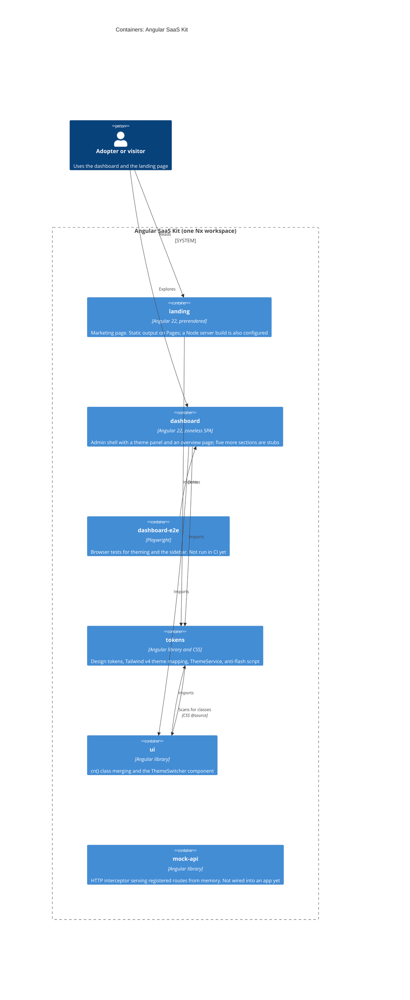

# Level 2: Containers

The deployable pieces and the libraries between them. The arrows between workspace
projects are checked against the source by
[`scripts/check-architecture.mjs`](../../scripts/check-architecture.mjs), so this
page cannot quietly go stale ([how](README.md#keeping-them-true)). Where the apps are
deployed is on the [deployment](c4-deployment.md) page.



## The containers

| Container       | Kind        | Tags                          | Notes                                                                                                                                                                                                                              |
| --------------- | ----------- | ----------------------------- | ---------------------------------------------------------------------------------------------------------------------------------------------------------------------------------------------------------------------------------- |
| `landing`       | application | `type:app`, `scope:landing`   | Prerendered, hydrates in the browser ([ADR 0007](../adr/0007-prerendered-landing-and-client-side-dashboard.md)).                                                                                                                   |
| `dashboard`     | application | `type:app`, `scope:dashboard` | Client-side SPA; hash routing in the Pages build ([ADR 0011](../adr/0011-github-pages-demo-site.md)).                                                                                                                              |
| `tokens`        | library     | `type:lib`, `scope:shared`    | Built as an npm package, but not publish-ready: the package omits its stylesheets. Imports no other project; its stylesheet scans `ui` for class names ([ADR 0004](../adr/0004-semantic-design-tokens-and-three-axis-theming.md)). |
| `ui`            | library     | `type:lib`, `scope:shared`    | Built as an npm package, but not publish-ready: `clsx`, `tailwind-merge` and `tokens` are not declared as dependencies. Imports only `tokens` ([ADR 0005](../adr/0005-angular-cdk-and-tailwind-instead-of-a-ui-library.md)).       |
| `mock-api`      | library     | `type:lib`, `scope:shared`    | Not published, and imported by no app yet ([ADR 0006](../adr/0006-in-memory-mock-api-instead-of-a-backend.md)).                                                                                                                    |
| `dashboard-e2e` | e2e         | none                          | Playwright, on Chromium, Firefox and WebKit, against `nx run dashboard:serve` on port 4200.                                                                                                                                        |

## Dependency direction

`landing` and `dashboard` depend on libraries, and `ui` depends on `tokens`:

```
landing ───┐
           ├──► tokens ◄── ui ◄── dashboard
dashboard ─┘       │        ▲
                   └────────┘   tokens' stylesheet scans ui (CSS only)
mock-api   (nothing depends on it yet)
```

Two kinds of edge are drawn on purpose, because `npx nx graph` shows only the first:

- **Imports**: TypeScript imports through the `@angular-saas-kit/*` path aliases.
- **Stylesheet references**: CSS `@import` and `@source` across project folders. Both
  apps get their design system through `@import '../../../libs/tokens/src/styles.css'`,
  and that entry file declares `@source '../../ui/src'` so Tailwind emits the utilities
  the `ui` templates use. That is the `tokens` to `ui` arrow: `ui` imports `tokens` in
  code, and `tokens` scans `ui` in CSS. It also means the entry stylesheet only works
  inside this workspace, because the path is relative to the monorepo.

`dashboard-e2e` reaches `dashboard` through `implicitDependencies` in its
`project.json`.

## What the map guarantees, and what it does not

The check makes the map and the code agree, in both directions: a dependency in the
source that is not drawn fails CI, and so does one drawn that no longer exists. A new
edge therefore shows up in review as a change to this page.

It does **not** forbid an edge. Nothing stops an app importing another app or a library
importing an app: the `type:` and `scope:` tags exist, but no
`@nx/enforce-module-boundaries` rule is configured
([ADR 0002](../adr/0002-nx-monorepo-with-two-apps-and-shared-libraries.md)).

## A coupling the map does not draw

`libs/tokens/src/lib/theme-init.spec.ts` reads `apps/dashboard/src/index.html` and
`apps/landing/src/index.html` to prove each still carries the same anti-flash script as
`THEME_INIT_SCRIPT`. It is a test reading files, not an import, so it is not an edge;
it is why editing that script means editing three places
([components](c4-components.md#tokens)).

Next: [components](c4-components.md).
