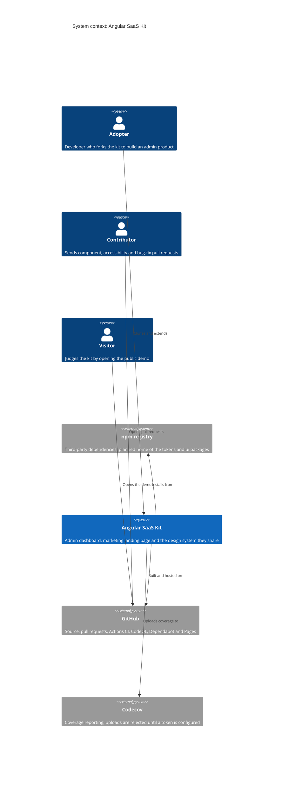

# Level 1: System context

The kit is a UI template: a dashboard and a landing page on one design system. It
has no backend and no authentication. This map shows the people who use it and the
outside systems it depends on.

## People

| Person          | What they do with the kit                                                                                                          |
| --------------- | ---------------------------------------------------------------------------------------------------------------------------------- |
| **Adopter**     | Clones the repository, changes the theme through three attributes on `<html>`, and builds pages on top. The reason the kit exists. |
| **Contributor** | Adds components and fixes, under the rules in `CONTRIBUTING.md`; every change goes through a pull request.                         |
| **Visitor**     | Opens the [live demo](https://nguyenan97.github.io/angular-saas-kit/) to decide whether the kit is worth adopting.                 |

## External systems

| System           | Role                                                                                                                    | State                                                                                          |
| ---------------- | ----------------------------------------------------------------------------------------------------------------------- | ---------------------------------------------------------------------------------------------- |
| **GitHub**       | Hosts the source; runs CI and CodeQL; Dependabot proposes updates; Pages serves the demo.                               | In use; `main` is protected ([ADR 0009](../adr/0009-strict-ci-gates-and-a-protected-main.md)). |
| **npm registry** | Source of every third-party dependency. `libs/tokens` and `libs/ui` have package builds, but are not publish-ready yet. | Consumed today; nothing is published yet.                                                      |
| **Codecov**      | Would show coverage on pull requests and in the README badge.                                                           | The upload is rejected (`Token required`); needs a `CODECOV_TOKEN`.                            |

## Left out on purpose

There is no application backend, identity provider or database to draw. The mock
API in `libs/mock-api` is a development aid, not a system
([ADR 0006](../adr/0006-in-memory-mock-api-instead-of-a-backend.md)). A product built
on the kit would add those next to the kit; this map is the kit alone.

Next: [containers](c4-containers.md).
