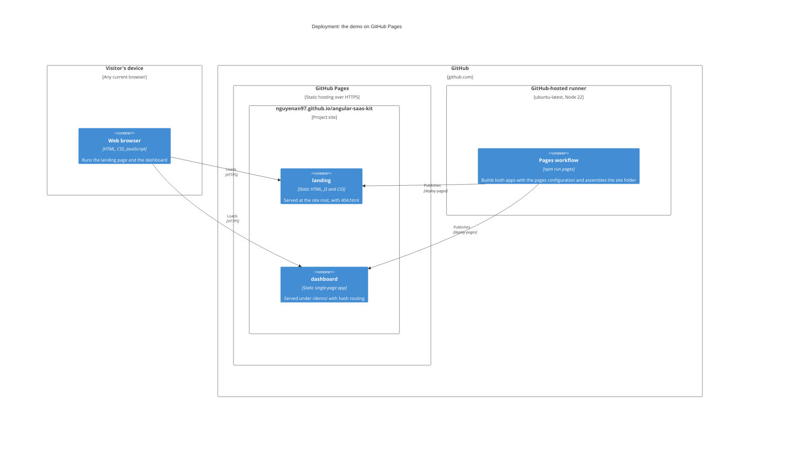
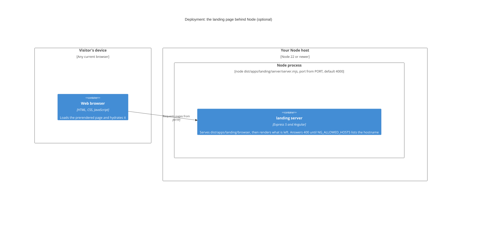
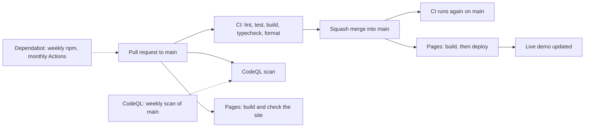

# Deployment

Where the kit runs. The demo on GitHub Pages is the only production deployment; the
rest is how a change gets there and how to run the kit yourself.

## The demo on GitHub Pages

Built and deployed by [`pages.yml`](../../.github/workflows/pages.yml), only from `main`
([ADR 0011](../adr/0011-github-pages-demo-site.md)).

## The landing page behind Node (optional)

The landing page can also run as a Node server. Nothing in this repository deploys it;
this is the shape if you do. Build it with `npx nx build landing`, then run
`node dist/apps/landing/server/server.mjs`.

The server refuses every request until `NG_ALLOWED_HOSTS` (or `security.allowedHosts` in
the build options) names the host it is served on
([ADR 0007](../adr/0007-prerendered-landing-and-client-side-dashboard.md)).

## How a change reaches the demo

The five CI checks are required and the branch must be up to date before a merge
([ADR 0009](../adr/0009-strict-ci-gates-and-a-protected-main.md)). CodeQL and the Pages
build run on every pull request but are not required.

## Running it locally

| Goal                                | Command                                       | Where                                                                       |
| ----------------------------------- | --------------------------------------------- | --------------------------------------------------------------------------- |
| Dashboard dev server                | `npm start`                                   | `http://localhost:4200`                                                     |
| Landing dev server                  | `npm run start:landing`                       | Angular's dev server; the terminal prints the address                       |
| The Pages build, as Pages serves it | `npm run pages`, then `npm run pages:preview` | `http://localhost:8123/angular-saas-kit/`                                   |
| Browser tests                       | `npx nx e2e dashboard-e2e`                    | Starts `nx run dashboard:serve` on port 4200, or reuses one already running |

Back to the [overview](README.md).
